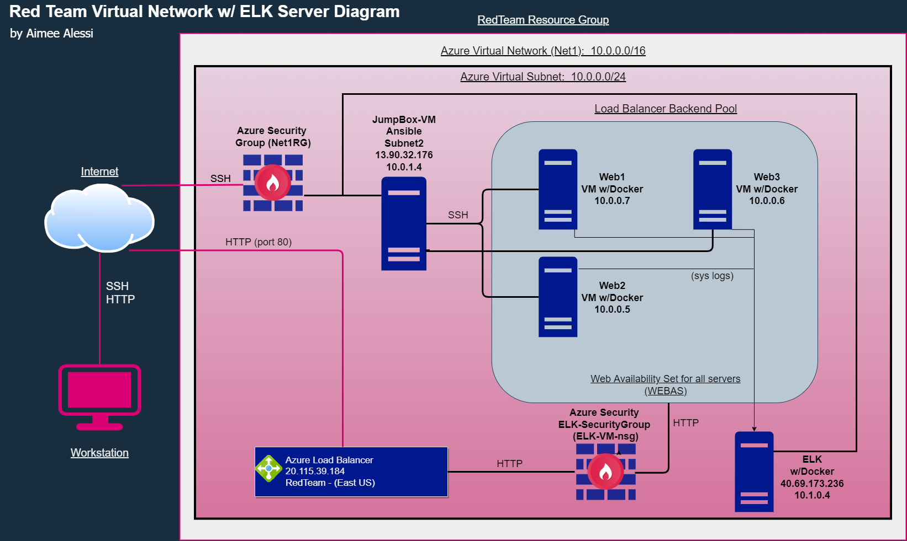

## Automated ELK Stack Deployment

The files in this repository were used to configure the network depicted below.

These files have been tested and used to generate a live ELK deployment on Azure. They can be used to either recreate the entire deployment pictured above. Alternatively, select portions of the _____ file may be used to install only certain pieces of it, such as Filebeat.

  - [ELK-playbook.yml](https://github.com/A3PO/Project1-Cyber/blob/main/Ansible/ansible/elk-playbook.yml)

    

This document contains the following details:
- Description of the Topology
- Access Policies
- ELK Configuration
  - Beats in Use
  - Machines Being Monitored
- How to Use the Ansible Build

### Description of the Topology

The main purpose of this network is to expose a load-balanced and monitored instance of DVWA, the D*mn Vulnerable Web Application.

Load balancing ensures that the application will be high performing, in addition to restricting traffic to the network.
- Load Balancers protect the network by distributing traffic evenly to prevent single server overload and failure when demand spikes.  This in turn enhances a user's experience by reducing their request response time.  Redundancy is also added to the network so should a portion of the network fail there is support elsewhere to pickup the added work.  The advantage of a jump box is that it acts as a single access point to a secure zone, forcing the user to authenticate there before accessing the resources it is protecting from unauthorized access.

Integrating an ELK server allows users to easily monitor the vulnerable VMs for changes to the traffic and system metrics.
- Filebeats monitors the logfiles of locations you specify.  It collects these logs and then forwards them to Elasticsearch or Logstash to be indexed.
- Metricbeat records metrics and statistics that it collects and then forwards them to the output you specify, whether it is Elasticsearch or Logstash.

The configuration details of each machine may be found below.

| Name     | Function | IP Address | Operating System |
| -------- | -------- | ---------- | ---------------- |
| Jump Box | Gateway  | 10.0.1.4   | Linux            |
| Web1     | Server   | 10.0.07    | Linux            |
| Web2     | Server   | 10.0.0.5   | Linux            |
| Web3     | Server   | 10.0.0.6   | Linux            |
| ELK      | server   | 10.1.0.4   | Linux            |

### Access Policies

The machines on the internal network are not exposed to the public Internet. 

Only the jump box machine and ELK machine can accept connections from the Internet. Access to these machines is only allowed from the following IP addresses:

- Home IP Address (dynamic)

Machines within the network can only be accessed by other machines within the Virtual Network and the load balancer.
- The only machine with access to the ELK VM is the Jump Box VM (10.0.1.4) as well as the only public access is from the home IP address.

A summary of the access policies in place can be found in the table below.

| Name                               | Publicly Accessible | Allowed IP Addresses       |
| :--------------------------------- | ------------------- | -------------------------- |
| Jump Box                           | Yes                 | Home IP Address (diynamic) |
| AllowSSH (JB- inbound)             | Yes                 | Home IP Address (dynamic)  |
| AllowHTTP (JB- inbound)            | Yes                 | Home IP Address (dynamic)  |
| AllowJumpBoxSSHtoWeb (JB- inbound) | No                  | 10.0.1.0/24                |
| AllowICMP (JB- inbound)            | Yes                 | Home IP Address (dynamic)  |
| AllowRDP (JB- inbound)             | Yes                 | Home IP Address (dynam     |
| SSH (ELK-inbound)                  | Yes                 | Home IP Address (dynamic)  |
| Port_5601 (ELK - inbound)          | Yes                 | Home IP Address (dynamic)  |

### Elk Configuration

Ansible was used to automate configuration of the ELK machine. No configuration was performed manually, which is advantageous because...
- The benefits of automating configurations with Ansible is you can then quickly make updates to your machine by rerunning your playbook, as well as configure many machines quickly and accurately.

The playbook implements the following tasks:

- First we access the Elk server by referring to the host file, where we have configured access to the ELK server
- Virtual Memory Size is increased to allow the ELK server to function.
- Next docker.io (docker) is downloaded
- Next pip3 is installed to help with the downloading and configuring of python modules
- Install Python Docker module
- Manage ELK container ports
- Enable the Docker Service

The following screenshot displays the result of running `sudo docker ps -a` after successfully configuring the ELK instance.

### Target Machines & Beats
This ELK server is configured to monitor the following machines:
- 10.0.0.7
- 10.0.0.5
- 10.0.0.6

We have installed the following Beats on these machines:
- Filebeats
- Metricbeats

These Beats allow us to collect the following information from each machine: (beats are a group of tools that collect different types of data and passes them on to be further analyzed through Elasticsearch or Kibana. 
- Filebeats is one of the beat tools to that collects log files and has the capability to 'ingest' them allowing for quicker analysis on the output side.
- Metricbeats helps to collect what it's name implies the metrics from your system.  These can be memory statistics to per process CPU.

### Using the Playbook
In order to use the playbook, you will need to have an Ansible control node already configured. Assuming you have such a control node provisioned: 

SSH into the control node and follow the steps below:
- Copy the [ELK-Playbook.yml](https://github.com/A3PO/Project1-Cyber/blob/main/Ansible/ansible/elk-playbook.yml) file to your  /etc/ansible directory. (Our containers were hardmounted so the ansible directory was placed in the /etc/ directory in the container and allowed you to access the jumpbox from the container.  This was accomplished by using `sudo docker exec -i -t ansible /bin/bash`) 
- Update the [(ansible) hosts file](https://github.com/A3PO/Project1-Cyber/blob/main/Ansible/ansible/hosts)  to include the IP addresses of the machines you would like the playbook to apply too, the locations for the IP addresses can be seen in the bracketed headers i.e. [ELK].  The Playbook will look at the hosts line to find which machines to apply the configurations to from the bracketed headers. (See the above hyperlink for an example from this exercise)
- SSH into your container and run the playbook using the command below in the jumpbox container (prompt: root@ansible:~#).  Also make sure you are in the directory containing the playbook.  
  - `sudo docker exec -i -t ansible /bin/bash`
  - `ansible-playbook elk-playbook.yml`

- Next navigate to the ELK-server's public IP address in your home browser to check that the installation worked as expected.

